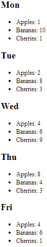

cfajaxproxy
===

The `<cfajaxproxy>` tag provides the ability to create a JavaScript proxy "class" which can be used to create proxy objects which in turn proxy for a ColdFusion CFC back on the ColdFusion server. This means JavaScript code can call methods on the JavaScript object, which will - in effect - execute functionality on the ColdFusion server.

Here is a very basic demonstration of using `<cfajaxproxy>` to create a JavaScript proxy object to fetch data from the ColdFusion server:

**Listing 1 : exampleUsingCfajaxproxy.cfm**
    
    <!doctype html>
    <html lang="en">
    <head>
        <meta charset="utf-8">
        <title>&lt;cfajaxproxy&gt; demo</title>
        
        
        <cfajaxproxy cfc="DAO" jsclassname="DAOProxy">
    </head>
    <body>
        

        
    </body>
    </html>

Note that even with the `<cfajaxproxy>` tag, one still needs to use JavaScript to *use* the proxy:

**Listing 2 : exampleUsingCfajaxproxy.js**
    
    $(document).ready(function(){
        var daoProxy = new DAOProxy();
        var data = daoProxy.getData();
        renderData($("#data-goes-here"), data);
    });    

I am using jQuery here as a matter of convenience; it's not related to the functionality of `<cfajaxproxy>`.

With the data returned from `DAO.cfc`, and rendered with `renderData.js` (see below for the code for each of these files), this outputs:

Now here is the same functionality, totally written in simple HTML and JavaScript (using jQuery for AJAX proxying functionality). 

**Listing 3 : exampleUsingJquery.html**
    
    <!doctype html>
    <html lang="en">
    <head>
        <meta charset="utf-8">
        <title>jQuery demo</title>
        
        
    </head>
    <body>
        

        
    </body>
    </html>

This listing is virtually identical to the mark-up used in `exampleUsingCfajaxproxy.cfm`, above, except for not having the call to `<cfajaxproxy>`.

**Listing 4 : exampleUsingJquery.js**
    
    $(document).ready(function(){
        $.ajax(
            "DAO.cfc?method=getData",
            {
                success : function(json){
                    data = JSON.parse(json);
                    renderData($("#data-goes-here"), data);
                }
            }
        );

    });
	
The JavaScript here uses jQuery to handle an AJAX call back to `DAO.cfc` the ColdFusion server. When the AJAX call returns the data, it's converted back from JSON to a JavaScript object, then rendered using the same code as the previous example.

This demonstrates that all `<cfajaxproxy>` is really doing is making an AJAX call, and deserialising the returned JSON. Which is very easy to do with jQuery and native JavaScript.

For completeness, here is the code for `DAO.cfc` and `renderData.js`, which are used in both examples:

**Listing 5 : DAO.cfc**

    component {

        remote struct function getData() returnformat="json" {
            return {
                "labels"    = ["Mon","Tue","Wed","Thu","Fri"],
                "records"    = [
                    {
                        "text"    ="Apples",
                        "values"=[1,2,4,8,4]
                    },{
                        "text"    ="Bananas",
                        "values"=[10,8,6,4,6]
                    },{
                        "text"    ="Cherries",
                        "values"=[1,3,9,3,1]
                    }
                ]
            };
        }
    }

**Listing 6 : renderData.js**

    renderData = function(element, data){
        data.labels.forEach(function(day,i){
            element.append("<h2>" + day + "</h2>")
                .append(
                    (function(){
                        return "<ul>"
                                + data.records.reduce(
                                    function(previousValue,currentValue){
                                        return previousValue + "<li>" + currentValue.text + ": " + currentValue.values[i] + "</li>";
                                    },
                                    ""
                                )
                                + "</ul>"
                        ;
                    })()
                );
            ;
        });
    };

Note that I've factored `renderData.js` out into a different file purely to simplify the example code. All it does is render the data as per the screen shot above. Also note that I'd generally try to use a templating library here to separate the mark-up and the JavaScript a bit more clearly, but that's not in the scope of this chapter, which is just focusing on the AJAX proxying.

Resources
---
* [jQuery API documentation: .ajax()](https://api.jquery.com/jQuery.ajax/)

Alternatives
---

* TBC