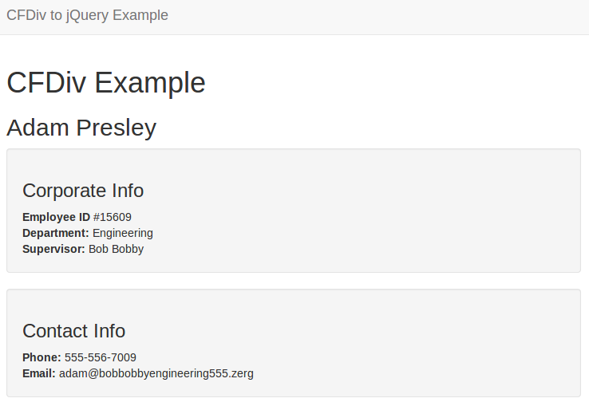
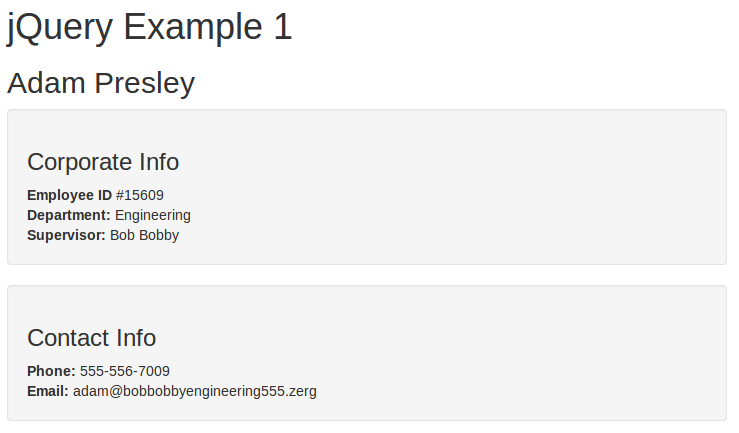
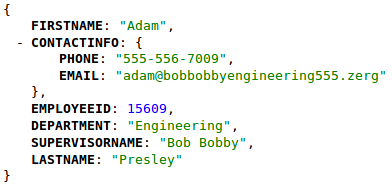
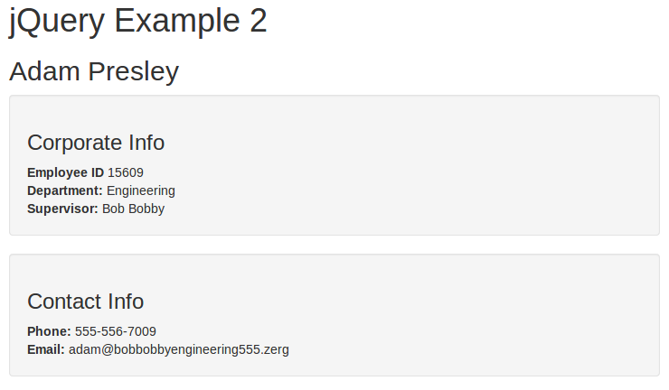

cfdiv
=====

*&lt;cfdiv&gt;* is ColdFusion UI tag which provides the ability to load external content on to your page. This tag also offers data-binding to HTML controls to automatically pass data between a bound control and the remote CFM or CFC. The following example illustrates a simple case of using *&lt;cfdiv&gt;* to load external content from a CFM page as well as the CFM page itself.

**Listing 1: Simple *&lt;cfdiv&gt;* example**

    <cfdiv bind="url:cfdiv-source.cfm" id="exampleContents" />
    

**Listing 2: CFM page containing loaded content - cfdiv-source.cfm**

    <cfscript>

        /*
         * Create a mock data source. This will loosely represent
         * an employee
         */
        data = {
            employeeId     = 15609,
            firstName      = "Adam",
            lastName       = "Presley",
            department     = "Engineering",
            supervisorName = "Bob Bobby",
            contactInfo    = {
                phone = "555-556-7009",
                email = "adam@bobbobbyengineering555.zerg"
            }
        };

    </cfscript>

    <cfoutput>

        <h2>#data.firstName# #data.lastName#</h2>

        <section class="well">
            <h3>Corporate Info</h3>

            <strong>Employee ID</strong> ###data.employeeId# 
            <strong>Department:</strong> #data.department# 
            <strong>Supervisor:</strong> #data.supervisorName# 
        </section>

        <section class="well">
            <h3>Contact Info</h3>

            <strong>Phone:</strong> #data.contactInfo.phone# 
            <strong>Email:</strong> #data.contactInfo.email# 
        </section>

    </cfoutput>

**Screenshot 1**

## An Alternative

In this chapter we will demonstrate loading dynamic content using jQuery. We will show two versions of loading dynamic content. The first is a fairly direct conversion which will load the HTML directly into a *&lt;div&gt;* tag. The second version will retrieve JSON (JavaScript Object Notation) content and update parts of the HTML page. Both of these examples will include CSS and markup using Twitter's excellent [Bootstrap](http://getbootstrap.com) framework.

### Direct Conversion
This first example will demonstrate loading dynamic, remote HTML content from a CFM file and placing those contents into a *&lt;div&gt;*. This example demonstrates creating an HTML page which not only includes the necessary Bootstrap CSS file and the jQuery JavaScript file, but also the JavaScript necessary to load the remote HTML content. jQuery and Bootstrap will be loaded from external CDNs (Content Delivery Network). 

**Listing 3: Populate *&lt;div&gt;* using jQuery**

    <!DOCTYPE html>
    <html lang="en">
    <head>
        <meta charset="utf-8" />
        <meta name="viewport" content="width=device-width, initial-scale=1.0" />
        <meta http-equiv="X-UA-Compatible" content="IE=Edge" />

        <title>CFDiv to jQuery Example</title>

        <link href="//netdna.bootstrapcdn.com/bootstrap/3.1.0/css/bootstrap.min.css" rel="stylesheet" />
        
    </head>

    <body>
        

            

                

                    <button type="button" class="navbar-toggle" data-toggle="collapse" data-target=".navbar-collapse">
                        
                        
                        
                    </button>
                    <a class="navbar-brand" href="/">CFDiv to jQuery Example</a>
                

            

        

        

            

                

                    <h1>jQuery Example 1</h1>
                    

                

            

        

        
    </body>
    </html>

Let's review the more important parts of this. First we must ensure we have included the jQuery library. Often you will have this file as part of your project in some folder containing static assets. In our case, however, we are simply requesting it from a CDN.

    

The next important difference is how we did **not** use *&lt;cfdiv&gt;* to create our *&lt;div&gt;* DOM element. We created a simple *&lt;div&gt;* tag and gave it an ID of **exampleContents**. This is important to remember because that ID is what we will use to tell jQuery what DOM element we are working with.

    

Then we have a bit of JavaScript. If you've never seen jQuery code before then some explanation is due. The first line is asking jQuery to select the *document* object in the DOM and to run a function when it is ready. For our purposes we want to load content from a remote CFM page when the DOM is ready.

    $("#exampleContents").load("/cfdiv-source.cfm");

That little bit of magic first selects the *&lt;div&gt;* tag with an ID of **exampleContents**. Then it calls the **load()** method with an argument telling jQuery to perform an AJAX call to retrieve the contents from the server-side CFM page **cfdiv-source.cfm** (the same file we used in the original *&lt;cfdiv&gt;* example). The **load()** method will take the contents rendered by the remote call and put it in the DOM as the HTML content for the **exampleContents** *&lt;div&gt;*. The result looks strikingly similar to the original example.

**Screenshot 2**

### Another Approach
Another approach we will demonstrate is returning just JSON data and populating specific DOM elements with the result of that data. The benefit to this approach is that less data is send back and forth between a client machine and the server. This becomes especially important for performance or limited bandwith situations. There are many ways to implement this method, and a great many more frameworks that help make this task easier in amazing ways, but for now we will simply show a basic example using only jQuery.

To begin let's first create a ColdFusion component that will create a sample bit of data and return this data serialized as a JSON object suitable for JavaScript use.

**Listing 4: dao.cfc**

    component {

        remote struct function getEmployeeData() returnformat="json" {
            /*
             * Ensure we have set our content type header correctly
             * and return a JSON object.
             */
            getPageContext().getResponse().setHeader("Content-Type", "text/json");

            return {
                employeeId     = 15609,
                firstName      = "Adam",
                lastName       = "Presley",
                department     = "Engineering",
                supervisorName = "Bob Bobby",
                contactInfo    = {
                    phone = "555-556-7009",
                    email = "adam@bobbobbyengineering555.zerg"
                }
            };
        }

    }

This component has a single method that can be accessed remotely and will serialize a returned structure as JSON data. To ensure the correct HTTP content type is set, and jQuery can easily identify the type of content returned we first set our **Content-Type** header to *text/json*. 

After doing that we will then return a structure of data to be serialized, or converted, to JSON data. This structure loosely represents data for an employee at some imaginary company. It includes information about this employee as well as contact information. It should look familiar, as this is the same information we saw in the previous two examples.

Now let's take a look at what our view page looks like.

**Listing 5: Example using jQuery v2**

    <!DOCTYPE html>
    <html lang="en">
    <head>
        <meta charset="utf-8" />
        <meta name="viewport" content="width=device-width, initial-scale=1.0" />
        <meta http-equiv="X-UA-Compatible" content="IE=Edge" />

        <title>CFDiv to jQuery Example</title>

        <link href="//netdna.bootstrapcdn.com/bootstrap/3.1.0/css/bootstrap.min.css" rel="stylesheet" />
        
    </head>

    <body>
        

            

                

                    <button type="button" class="navbar-toggle" data-toggle="collapse" data-target=".navbar-collapse">
                        
                        
                        
                    </button>
                    <a class="navbar-brand" href="/">CFDiv to jQuery Example</a>
                

            

        

        

            

                

                    <h1>jQuery Example 2</h1>
                    

                        <h2 id="fullName"></h2>

                        <section class="well">
                            <h3>Corporate Info</h3>

                            <strong>Employee ID</strong>  
                            <strong>Department:</strong>  
                            <strong>Supervisor:</strong>  
                        </section>

                        <section class="well">
                            <h3>Contact Info</h3>

                            <strong>Phone:</strong>  
                            <strong>Email:</strong>  
                        </section>
                    

                

            

        

        
    </body>
    </html>

Notice that the HTML markup that *used* to be in the remote CFM page is now in our main view page. There is a difference however. Instead of having variables displayed for all the employee information we have *&lt;span&gt;* tags with IDs for each piece of employee data we want to show.

    <section class="well">
        <h3>Corporate Info</h3>

        <strong>Employee ID</strong>  
        <strong>Department:</strong>  
        <strong>Supervisor:</strong>  
    </section>

    <section class="well">
        <h3>Contact Info</h3>

        <strong>Phone:</strong>  
        <strong>Email:</strong>  
    </section>

So how do we put the employee data into those *&lt;span&gt;* tags? The following JavaScript does the job. It first makes an AJAX call to our DAO component. When the AJAX call comes back successfully the **done()** method is called. Inside here we select each *&lt;span&gt;* tag and set the HTML content, pulling the data from the result of the AJAX call. 

    $.ajax({
        url: "/dao.cfc?method=getEmployeeData",
        method: "GET"
    }).done(function(data) {
        $("#fullName").html(data.FIRSTNAME + " " + data.LASTNAME);
        $("#employeeId").html(data.EMPLOYEEID);
        $("#department").html(data.DEPARTMENT);
        $("#supervisorName").html(data.SUPERVISORNAME);
        $("#phone").html(data.CONTACTINFO.PHONE);
        $("#email").html(data.CONTACTINFO.EMAIL);
    });

You might be wondering what that data looks like. It is a JSON object, and is very similar in nature to the original ColdFusion structure. It looks like this.

As you can see each key name being referenced in the object named *data* exists as a key in the JSON object being returned from ColdFusion.

Finally here is a screenshot of the final result. Once again it looks very much like the other two.

**Screenshot 3**

## Additional References and Info

* [jQuery](http://jquery.com) - Awesome JavaScript library
* [Ractive](http://www.ractivejs.org/) - Cool DOM manipulation library
* [AngularJS](http://angularjs.org/) - Big, powerful DOM manipulation, templating, and way more

