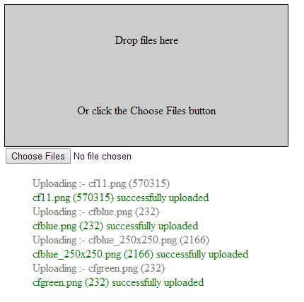

CFFILEUPLOAD - MULTIPLE
===
The `<cffileupload>` tag displays a dialog for uploading multiple files from the user's system.

I'm not going to re-create the whole upload interface dialog here, but we will be able to upload multiple files by either choosing them by pressing the "Choose Files" Button or using drag and drop.

**Listing 1 : index.cfm**

    <!DOCTYPE html>
    <html lang="en">
    <head>
        <meta charset="utf-8">
        <title>CFFILEUPLOAD Alternative</title>
        <link rel="stylesheet" href="css/custom.css">
        
        
    </head>
    <body>
        

         Drop files here 
         Or click the Choose Files button
        

        <input id="btnChooseFiles" name="btnChooseFiles" value="Choose Files" type="file" multiple>
        

            <ul class="uploadLog">
                <li></li>
            </ul>
        

    </body>
    <footer>
    </footer>
    </html>

A light dusting of CSS :-

**Listing 2 : custom.css**

    ul li {
        list-style-type: none;
    }
    #dropFiles {
        height: 200px; 
        width: 400px; 
        line-height: 100px; 
        background-color: #cccccc;
        color: #000000; 
        border: 1px solid #000000;
        text-align: center;
    }
    .uploading {
        color: grey;
    }
    .complete {
        color: green;
    }
    .error {
        color: red;
    }

And this is the meat and potatoes.

**Listing 3 : main.js**

    $(document).ready(function() {
        //IGNORE dragover EVENT
        $('#dropFiles').on(
            'dragover',
            function(e) {
                e.preventDefault();
                e.stopPropagation();
            }
        );
        //IGNORE dragenter EVENT
        $('#dropFiles').on(
            'dragenter',
            function(e) {
                e.preventDefault();
                e.stopPropagation();
            }
        );
        //PROCESS the change EVENT WHEN FILES ARE CHOSEN VIA THE BUTTON
        $('#btnChooseFiles').on ('change', function(e) {
            e.preventDefault();
            e.stopPropagation();
            var files = $('#btnChooseFiles').prop("files");
            clearMessages();
            uploadFiles(files);
        });
        // PROCESS THE drop EVENT WHEN FILES ARE DROPPED
        $('#dropFiles').on ('drop', function(e) {
            e.preventDefault();
            e.stopPropagation();
            var files = event.dataTransfer.files;
            clearMessages();
            uploadFiles(files);
        });
        // UPLOAD THE FILES
        function uploadFiles(filesCollection){
            // ALLOWED FILE TYPES
            var allowedFileTypes = ['image/jpeg','image/png','image/gif']
            // NUMBER OF FILES BEING UPLOADED
            var numberOfFiles = filesCollection.length;
            // LOOP OVER THE FILES
            for (var i=0;i < numberOfFiles; i++) {
                // GET THE FILE INFO
                var fileName = filesCollection[i].name;
                var fileSize = filesCollection[i].size;
                var fileType = filesCollection[i].type;
                // WHAT TYPE OF FILES ARE WE GOING TO ALLOW
                var found = $.inArray(fileType, allowedFileTypes) > -1;
                if (found){
                    // DEFINE A FORM BECAUSE WE DON'T HAVE ONE
                    var newForm = new FormData();
                    newForm.append("fileToUpload", filesCollection[i]);
                    newForm.append("fileName", fileName);
                    // DEFINE THE XMLHttpRequest OBJECT
                    var xhr = new XMLHttpRequest();
                    // DISPLAY MESSAGE THAT FILE IS BEING UPLOADED
                    message('uploading',fileName,fileSize,fileType);
                    // LISTEN TO THE "load" EVENT AND DISPLAY MESSAGE WHEN THE EVENT FIRES
                    xhr.addEventListener("load", message('complete',fileName,fileSize,fileType),true);
                    // OPEN CONNECTION TO upload.cfm (method, file, asynch)
                    xhr.open("post", "upload.cfm", true);
                    // SEND THE FILE
                    xhr.send(newForm);
                }
                else {
                    // IF THE MIME TYPE IS NOT IN OUR ALLOWED COLLECTION THEN SHOW AN ERROR
                    message('error',fileName,fileSize,fileType);
                }
            }
            //CLEAR THE FILES READY FOR THE NEXT UPLOAD
            clearFiles();
        }
        // CLEAR ALL MESAGES
        function clearMessages(){
            $('.uploadLog').html('');
        }    
        // CLEAR ALL FILES
        function clearFiles(){
            //CLEAR THE FILES SO THAT WE START AFRESH WITH NO FILES AT ALL
            $("#dropFiles").value = null;
            $("#btnChooseFiles").value = null;
            //CLEAR THE FILES NAMES ( OR NO. OF FILES ) FROM THE INPUT BOX
            $("#btnChooseFiles").val('');
        }
        //DISPLAY A MESSAGES
        function message(messageId,fileName,fileSize,fileType){
            // FORMAT THE MESSAGE
            var messageText = '';
            if(messageId === 'uploading') {
                messageText = 'Uploading :- ' + fileName + ' (' + fileSize + ')';
            }
            if(messageId === 'complete') {
                messageText = fileName + ' (' + fileSize + ')' + ' successfully uploaded';
            }
            if(messageId === 'error') {
                messageText = fileName + ' is an invalid file type (' + fileType + ')';
            }
            //BUILD THE <li>
             messageElement = '<li class="' + messageId + '">' + messageText + '</li>';
            // SHOW THE CURRENT MESSAGE
            $('.uploadLog').append(messageElement);
        }
    });

For further information you can reference :-

* [cffileupload](http://help.adobe.com/en_US/ColdFusion/9.0/CFMLRef/WSc3ff6d0ea77859461172e0811cbec18238-7fd0.html)
* [jQuery File Upload](http://blueimp.github.io/jQuery-File-Upload/)
* [FineUploader ](http://fineuploader.com/demos.html)

