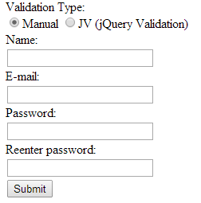

CFFORM-VALIDATE
===

On **Ray Camden's** blog there is a [Post](http://www.raymondcamden.com/index.cfm/2014/5/12/ColdFusion-UI-The-Right-Way--An-Update-and-Thanks#more) where **John Pullman** likes the idea of not using CF-UI tags anymore, but is hesitant due to the following.

*But I have to say that I find cfwindow, cfform, cfinput and the associated error handling very easy to use and it is still hard for me to face the idea of stopping what I am doing and taking the time to learn a new language like jQuery and a new set of tools. So for me the thing that will be most useful is good real life examples that will help me get started on that change. Much of what I know I learn by seeing what someone else does and adapting it to my needs.*      

So hopefully this will help with the **Validation** portion of what John is saying.

The `<cfform>` tag is required if you are using CF-UI tags (not all of them but enough).

Now **IF** you have have refactored your code so that you do not need to use  CF-UI tags you may still have the `<cfform>` tag in place and I am guessing that one of the reasons that it is still there is that you use it for **Validation**.

So here I am going to address that with a simple demo.

This demo has two validation methods, a manual one and one that uses the [.validate](http://http://jqueryvalidation.org/) jQuery plugin.

Let's start with a `<cfform>` example that I have tweaked so that it looks almost like the alternative that I am going to give you.

**Listing 1 : cfform.cfm**

    <cfset aryMessage = 
        [
            'You must enter a name.',
            'You must enter a valid e-mail address.',
            'You must enter a password.',
            'You must enter your password twice.'
        ]
    >
    <!doctype html>
    <html lang="en">
    <head>
        <meta charset="utf-8" />
        <meta name="viewport" content="width=1024" />
        <title>CFFORM - ALTERNATIVE</title>
        <link rel="stylesheet" type="text/css" href="css/custom.css">
    </head>
    <body>
    <cfoutput>
        <cfif IsDefined("form.fieldnames")>
            <cfdump var="#form#"> 
        </cfif>
        <cfform name="myform" preservedata="Yes">
            <ul>
                <li>Name:</li>
                <li><cfinput type="text" size="25" name="name" required="yes" message="#aryMessage[1]#"></li>
                <li>E-mail:</li>
                <li><cfinput type="text" size="25" name="email" required="yes" validate="email" message="#aryMessage[2]#"></li>
                <li>Password:</li>
                <li><cfinput type="password" size="25" name="password1" required="yes" maxlength="12" message="#aryMessage[3]#"></li>
                <li>Reenter password:</li>
                <li><cfinput type="password" size="25" name="password2" required="yes" maxlength="12" message="#aryMessage[4]#"></li>
                <li><cfinput type="submit" name="submitit"></li>
            </ul>
        </cfform>
    </cfoutput>
    </body>
    </html>

Ok so thats how you do it with `<cfform>` but there is already a problem, it does not compare the PASSWORDS to see if they match. So right off the bat you have to figure out how to do that.

So here is an alternative just using some simple jQuery OR the [.validate](http://http://jqueryvalidation.org/) jQuery plugin to validate the input.

This is just a demo, for production you should also **validate with CF** after the form has been submitted.

**Listing 2 : index.cfm**

    <!doctype html>
    <html lang="en">
    <head>
        <meta charset="utf-8" />
        <meta name="viewport" content="width=1024" />
        <title>CFFORM - ALTERNATIVE</title>
        <link rel="stylesheet" type="text/css" href="css/custom.css">
        
        
    </head>
    <body>
    <cfoutput>
        <cfif IsDefined("FORM.submitit")>
            <cfdump var="#form#"> 
        </cfif>
        <form id="myform" name="myform" action="index.cfm" enctype="multipart/form-data" method="post">
            <ul>
                <li>Validation Type:</li>
                <li>
                    <input id="radValidationType" name="radValidationType" type="radio" value="manual" checked>Manual
                    <input id="radValidationType" name="radValidationType" type="radio" value="JV">JV (jQuery Validation)
                </li>
                <li>Name:</li>
                <li><input id="name" name="name" type="text" size="25"></li>
                <li>E-mail:</li>
                <li><input id="email" name="email" type="text" size="25"></li>
                <li>Password:</li>
                <li><input id="password1" name="password1" type="password" size="25"></li>
                <li>Reenter password:</li>
                <li><input id="password2" name="password2" type="password" size="25"></li>
                <li><input id="submitit" name="submitit" type="submit"></li>
            </ul>
        </form>
    </cfoutput>
    </body>
    <footer>
        
    </footer>
    </html>

And here is the jQuery. ( The code is documented to help you ).

**Listing 3 : main.js**

    //THIS FUNCTION CHECKS THAT A VALID EMAIL HAS BEEN ENTERED
    //THIS IS ONLY USED WHEN manual VALIDATION IS SELECTED
    function validateEmail(email) { 
        var re = /^(([^<>()[\]\\.,;:\s@\"]+(\.[^<>()[\]\\.,;:\s@\"]+)*)|(\".+\"))@((\[[0-9]{1,3}\.[0-9]{1,3}\.[0-9]{1,3}\.[0-9]{1,3}\])|(([a-zA-Z\-0-9]+\.)+[a-zA-Z]{2,}))$/;
        return re.test(email);
    }
    //THIS FUNCTION IS CALLED WHEN THE RADIO BUTTO IS SET TO manual
    function validationManual(){
        //HERE WE BUILD THE ERROR MESSAGE ( IF THERE IS ONE )
        var strErrMessage = '';
        //CHECK THAT A name HAS BEEN ENTERED
        if($("#name").val() === '') {
            strErrMessage += 'You must enter a name.\n';
        }
        //CHECK THAT AN email HAS BEEN ENTERED AND THAT IT IS VALID
        if(!validateEmail($("#email").val())) {
            strErrMessage += 'You must enter a valid e-mail address.\n';
        }
        //CHECK THAT password1 HAS BEEN ENTERED
        if($("#password1").val() === '') {
            strErrMessage += 'You must enter a password.\n';
        }
        //CHECK THAT password2 HAS BEEN ENTERED
        if($("#password2").val() === '') {
            strErrMessage += 'You must enter your password twice.\n';
        }
        //CHECK THAT THE PASSWORDS MATCH
        if($("#password1").val() !== '' && $("#password2").val() !== '') {
            if($("#password1").val() !== $("#password2").val()) {
                strErrMessage += 'Passwords do not match.\n';
            }
        }
        //IF THERE IS AN ERROR MESSAGE TO DISPLAY THEN
        //STOP THE FORM FROM SUBMITTING
        //AND DISPLAY THE ERROR MESSAGE
        if(strErrMessage !== '') {
            alert(strErrMessage);
        }
    }
    //THIS FUNCTION IS CALLED WHEN THE RADIO BUTTO IS SET TO JV
    function validationJV(){
        //HERE WE SET UP THE RULES AND CALL THE VALIDATION ON THE myform ELEMENT
        $( "#myform" ).validate({
            rules: {
                name: "required",
                email: "email",
                password1: "required",
                password2: {
                    equalTo: "#password1"
                }
            }
        });
    }
    $(document).on( "click", "#submitit", function(e) {
        //GET THE SELECTED RADIO BUTTON VALUE
        var radType = $('input[name=radValidationType]:checked', '#myform').val();
        //CHOOSE THE CORRECT VALIDATION BASED ON THE RADIO BUTTON SELECTION
        if(radType === 'manual') {
            validationManual();
        }
        else {
            validationJV();
        }
    });

And there is a tiny bit of CSS.

**Listing 4 : custom.css**

    ul li {
        list-style-type: none;
    }

For further information you can reference :-

* [CFFORM](http://livedocs.adobe.com/coldfusion/8/htmldocs/help.html?content=Tags_f_13.html)
* [.validate jQuery Plugin](http://http://jqueryvalidation.org/)

