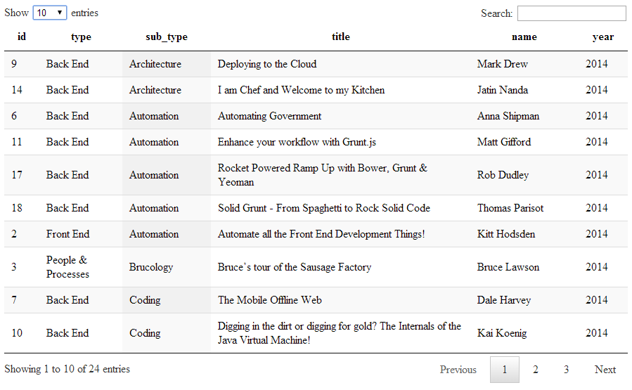

CFGRID
===
The `<cfgrid>` tag lets you create a grid using a query call.

We can do the same with **Datatables**.
Here is a screen shot of what we will end up with.

Just using the default settings of **Datatables** lets you.

* Choose the amount of records to view in the table.
* Search the table.
* Order the columns by clicking on the column headings.
* Gives you Previous, Next and Pagination buttons.

**Listing 1 : index.cfm**

    <cfsetting showdebugoutput="false">
    <!--- CREATE THE CFC OBJECT --->
    <cfset objContent = createObject("component", "cfc.content") />
    <!--- OBTAIN THE DATA --->
    <cfset qryData = objContent.srcData() />
    <!doctype html>
    <html lang="en">
    <head>
        <meta charset="utf-8" />
        <meta name="viewport" content="width=1024" />
        <title>CFGRID - ALTERNATIVE USING datatables</title>
        <link rel="stylesheet" type="text/css" href="css/jquery.dataTables.min.css">
    </head>
    <cfoutput>
    <body>
        

            <table id="dt_table" class="display">
                <thead>
                    <tr>
                        <th>ID</th>
                        <th>Type</th>
                        <th>Sub_Type</th>
                        <th>Title</th>
                        <th>Name</th>
                        <th>Year</th>
                    </tr>
                </thead>
                <tbody>
                    <cfloop query="qryData">
                        <tr>
                            <td>#qryData.id#</td>
                            <td>#qryData.type#</td>
                            <td>#qryData.sub_type#</td>
                            <td>#qryData.title#</td>
                            <td>#qryData.name#</td>
                            <td>#qryData.year#</td>
                        </tr>
                    </cfloop>
                </tbody>
            </table>
        

    </body>
    </cfoutput>
    <footer>
        
        
        
    </footer>
    </html>

And the CFC.

**Listing 2 : content.cfc**

    <cfcomponent>
        <!--- LOAD THE DATA --->
        <cfinclude template="data.cfm">
        <!--- GET THE DATA --->
        <cffunction name="srcData" access="public" returntype="query">
            <cfset var qrydata = ''>
            <cfquery name="qrydata" dbtype="query">
                SELECT *
                FROM tblData
            </cfquery>
            <cfreturn qrydata />
        </cffunction>
    </cfcomponent>

The tblData query is defined via code as a simulated query in [data.cfm](demo/cfc/data.cfm).

For further information you can reference :-

* [CFPOD](http://livedocs.adobe.com/coldfusion/8/htmldocs/help.html?content=Tags_p-q_07.html)
* [DATATABLES](http://datatables.net/)
