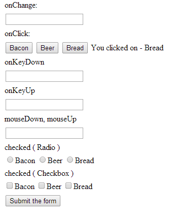

CFINPUT-EVENTS
===

The `<cfinput>` tag contains lots of event attributes, here we are going to deal with the following :-

    checked     <cfinput> uses "checked" for RADIO and CHECKBOX elements. 
    
    onChange    All of the following can be captured by javascript/jQuery events.
    onClick
    onChange
    onKeyDown
    onKeyUp
    onMouseDown
    onMouseUp

In listing 1 we are using a call to a cfc to get the data that feeds into the onClick Buttons and the Radio and Checkbox Elements.

**Listing 1 : index.cfm**

    <!--- CREATE THE CFC OBJECT --->
    <cfset objContent = createObject("component", "cfc.content") />
    <!--- OBTAIN THE SLIDE DECKS --->
    <cfset qryData = objContent.srcData() />
    <!DOCTYPE html>
    <html lang="en">
    <head>
        <meta charset="utf-8">
        <title>CFINPUT Events Alternatives</title>
        <link rel="stylesheet" href="css/custom.css">
    </head>
    <cfoutput>
    <body>
        <form name="mainForm" action="index.cfm" method="post">
            <ul>
                <li>
                    onChange:
                </li>
                <li>
                    <input type="text" name="txtOnChange" id="txtOnChange" />
                    
                </li>
                <li>
                    onClick:
                </li>
                <li>
                    <cfloop query="qryData">
                        <input  class="txtOnClick"
                                id="txtOnClick_#qryData.currentrow#" 
                                name="txtOnClick_#qryData.currentrow#" 
                                type="button" 
                                value="#qryData.name#"
                        >
                    </cfloop>
                    
                </li>
                <li>
                    onKeyDown
                </li>
                <li>
                    <input type="text" name="txtOnKeyDown" id="txtOnKeyDown" />
                    
                </li>
                <li>
                    onKeyUp
                </li>
                <li>
                    <input type="text" name="txtOnKeyUp" id="txtOnKeyUp" />
                    
                </li>
                <li>
                    mouseDown, mouseUp
                </li>
                <li>
                    <input type="text" name="txtOnMouseDownUp" id="txtOnMouseDownUp" />
                    
                </li>
                <li>
                    checked ( Radio )
                </li>
                <li>
                    <cfloop query="qryData">
                        <input class="radChecked" id="radChecked_#qryData.id#" name="radChecked" type="radio" value="#qryData.name#">#qryData.name#
                    </cfloop>
                    
                </li>
                <li>
                    checked ( Checkbox )
                </li>
                <li>
                    <cfloop query="qryData">
                        <input class="chkChecked" id="chkChecked_#qryData.id#" name="chkChecked" type="checkbox" value="#qryData.name#">#qryData.name#
                    </cfloop>
                    
                </li>
                <li>
                    <button type="submit" name="submitMainForm" id="submitMainForm">Submit the form</button>
                </li>
            </ul>
            <!--- THESE TWO VARIABLES ARE CHANGE BY THE JS THAT RUNS WHEN submitName IS CLICKED  --->
            <input type="hidden" name="firstName" id="firstName" value="">
            <input type="hidden" name="lastName" id="lastName" value="">
        </form>
    </body>
    </cfoutput>
    <footer>
        
        
    </footer>
    </html>
    <cfif IsDefined("submitMainForm")>
        <cfdump var="#FORM#">
    </cfif>

**Listing 2 : data.cfm**

    <cfset tblData=queryNew(
        "id,name",
        "integer,varchar",
    [
        {   
            id:1,
            name:'Bacon'
        }
        ,
        {   
            id:2,
            name:'Beer'
        }
        ,
        {   
            id:3,
            name:'Bread'
        }
    ])>

**Listing 3 : content.cfc**

    <cfcomponent>
        <cfinclude template="data.cfm">
        <cffunction name="srcData" access="public" returntype="query">
            <cfset var qrySlideDecks = ''>
            <cfquery name="qryData" dbtype="query">
                SELECT *
                FROM tblData
            </cfquery>
            <cfreturn qryData />
        </cffunction>
    </cfcomponent>

**Listing 4 : main.js**

    $(document).on( "change", "#txtOnChange", function(e) {
        $("#msgOnChange").html('You entered - ' + $("#txtOnChange").val());
    });
    $(document).on( "click", ".txtOnClick", function(e) {
        $("#msgOnClick").html('You clicked on - ' + $(this).val());
    });
    $(document).on( "keydown", "#txtOnKeyDown", function(e) {
        $("#msgOnKeyDown").html('You pressed - ' + $("#txtOnKeyDown").val());
    });
    $(document).on( "keyup", "#txtOnKeyUp", function(e) {
        $("#msgOnKeyUp").html('You pressed - ' + $("#txtOnKeyUp").val());
    });
    $(document).on( "mousedown", "#txtOnMouseDownUp", function(e) {
        $("#msgOnMouseDownUp").html('Mouse Down');
    });
    $(document).on( "mouseup", "#txtOnMouseDownUp", function(e) {
        $("#msgOnMouseDownUp").html('Mouse Up');
    });
    $(document).on( "click", ".radChecked", function(e) {
        $("#msgRadChecked").html('You chose - ' + $(this).val());
    });
    $(document).on( "click", ".chkChecked", function(e) {
        var strMsg ='You chose -';
        console.log('here');
        $(".chkChecked:checked").each(function () {
            console.log($(this).val());
            strMsg = strMsg + ' ' + $(this).val();
        });
        $("#msgChkChecked").html(strMsg);
    });

**Listing 5 - custom.css**

    ul li {
        margin-left: -20px;
        margin-bottom: 5px;
        list-style-type: none;
    }
    .msg {
        color: blue;
    }

For further information you can reference :-

* [CFINPUT](http://livedocs.adobe.com/coldfusion/8/htmldocs/help.html?content=Tags_i_07.html)

