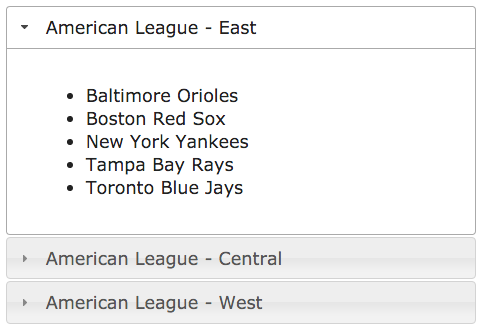

cflayout Accordion
===

Similar to the tabbed layout created in the [cflayout Tabs](https://github.com/cfjedimaster/ColdFusion-UI-the-Right-Way/blob/master/chapters/cflayout-tabs/index.md) chapter, the &lt;cflayout&gt; tag can also create an "accordion" layout. Accordion layouts contain one or more panel-like areas that can be expanded and collapsed by the user. Here is an example of how to create an accordion layout using the &lt;cflayout&gt; tag:
```
<cflayout type="accordion" height="300">
    <cflayoutarea title="American League - East">
        <ul>
            <li>Baltimore Orioles</li>
            <li>Boston Red Sox</li>
            <li>New York Yankees</li>
            <li>Tampa Bay Rays</li>
            <li>Toronto Blue Jays</li>
        </ul>
    </cflayoutarea>
    <cflayoutarea title="American League - Central">
        <ul>
            <li>Chicago White Sox</li>
            <li>Cleveland Indians</li>
            <li>Detroit Tigers</li>
            <li>Kansas City Royals</li>
            <li>Minnesota Twins</li>
        </ul>
    </cflayoutarea>
    <cflayoutarea title="American League - West" source="alwest.cfm" refreshOnActivate="true" />
</cflayout>
```

Embedding this code on a webpage will result in an accordion interface with 3 distinct sections that can be expanded and collapsed. The content for the first 2 accordion sections is written directly into the page markup. The content for the last accordion section is loaded dynamically from the "alwest.cfm" file as specified in the "source" attribute. 

The cflayout-tabs chapter uses the Bootstrap Tabs plugin as an alternative method to create the tabbed layout. The same plugin can be used just as effectively to accomplish the accordion layout. However, for an alternate perspective we'll use [jQuery UI](https://jqueryui.com/) in this chapter. 

Let's take a look at how to implement the same functionality using jQuery UI:
**Listing 1 : index.cfm**
```html
<!doctype html>
<html lang="en">
    <head>
        <meta charset="utf-8">
        <title>Accordion Layout Using jQuery UI</title>
        <link rel="stylesheet" href="//code.jquery.com/ui/1.11.4/themes/smoothness/jquery-ui.css">
        <style>
            body {margin: 20px;}
        </style>
    </head>
    <body>
        <div id="accordion">
            <h3>American League - East</h3>
            <div>
                <ul>
                    <li>Baltimore Orioles</li>
                    <li>Boston Red Sox</li>
                    <li>New York Yankees</li>
                    <li>Tampa Bay Rays</li>
                    <li>Toronto Blue Jays</li>
                </ul>
            </div>
            <h3>American League - Central</h3>
            <div>
                 <ul>
                    <li>Chicago White Sox</li>
                    <li>Cleveland Indians</li>
                    <li>Detroit Tigers</li>
                    <li>Kansas City Royals</li>
                    <li>Minnesota Twins</li>
                </ul>
            </div>
            <h3 data-content="alwest.cfm" data-target="#alwestDiv">American League - West</h3>
            <div id="alwestDiv"></div>
        </div>
        <script src="//code.jquery.com/jquery.js"></script>
        <script src="//code.jquery.com/ui/1.11.4/jquery-ui.js"></script>
        <script src="./resources/accordionscript.js"></script>
    </body>
</html>
```
Note that directly before the &lt;/body&gt; tag we are loading jQuery and jQuery UI - both are required. We are also loading our own JS file that will be used to initialize and listen for events on our accordion. Finally, you'll notice we include a stylesheet between the &lt;head&gt; tags that contains a standard jQuery UI theme to add some styling to our accordion. 



As you can see, the markup for our accordion interface is pretty simple. All the accordion panels are defined inside a parent &lt;div&gt; tab which we are assigning an ID of "accordion". By default, the &lt;h3&gt; tags found just below our parent div will be used as the panel headers. This can be changed/customized if you prefer. Consult the [jQuery UI API Documentation](http://api.jqueryui.com/accordion/) for more information.

Just like the &lt;cflayout&gt; example, the content for the first 2 panels is embedded directly into the page markup. The content for the last panel is going to be loaded from an external source. To accomplish this we need to indicate where to fetch the content from, and where to load it. There are various ways to do that, but we are going to use *data-* attributes on the &lt;h3&gt; tag. The *data-content* attribute will let us know where to get the panel content, and the *data-target* attributue will let us know where to insert the content into our page.

**Listing 2 : accordionscript.js**

```javascript
$(function() {
    $("#accordion").accordion({
        beforeActivate: function(event, ui) {
            var $header = ui.newHeader,
                content = $header.data("content"),
                target = $header.data("target");
            if (content !== undefined && target !== undefined) {
                $(target).load(content);
            }
        }
    });
});
```

Generally, we can simply initialize our accordion by using `$("#accordion).accordion();`. However, because we want to load some remote content we need to be a little more advanced and add some additional configuration settings when we initialize our accordion. Again, refer to the [jQuery UI API Documentation](http://api.jqueryui.com/accordion/) for more information.

The beforeActivate option allows us to take action on a particular panel before it is activated. We'll take advantage of this by checking to see if the *data-content* and *data-target* attributes are specified on the panel header, and if so, load the content as directed. 

Alternatives
---
* [Twitter Bootstrap](http://getbootstrap.com/javascript/#collapse-example-accordion)