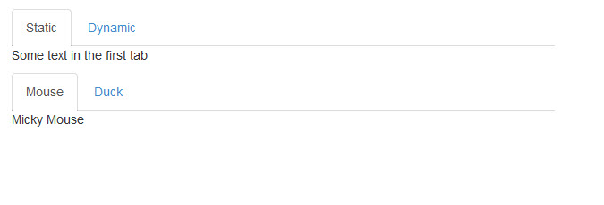
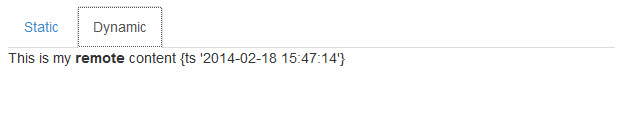
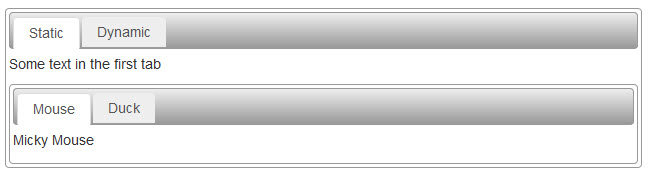

cflayout Tabs
===

The &lt;cflayout&gt; tag is an unfortunate layout catchall, with many different configurations, on of which provides the ability to create tabbed interfaces. As an example:

    <cflayout type="tab" tabHeight="200">
        <cflayoutarea title="Static">
            Some text in the first tab  
            <cflayout type="tab" tabHeight="100">
                <cflayoutarea title="Mouse" style="background-color:##00FFFF;" >
                    Mickey Mouse
                </cflayoutarea>
                <cflayoutarea title="Duck">
                    Donald Duck
                </cflayoutarea>
            </cflayout>
        </cflayoutarea>
        <cflayoutarea title="Dynamic" source="mycontent.cfm" refreshOnActivate="true" />
    </cflayout>
    
When the user opens the page, it loads a tabbed interface. Clicking on a tab will open the content of that tab The content of the "Dynamic" tab is loaded from a remote file via the "source" attribute. Other attributes include basic styling options.

For this example, we will make use of the [Bootstrap Tabs](http://getbootstrap.com/javascript/#tabs) plugin. Bootstrap is a lightweight framework of CSS and minimal JavaScript, allowing you to create dynamic interfaces with very little code, and focusing more on convention over configuration. For this example, we will use a CDN (Content Delivery Network) to include the necessary jQuery and Bootstrap files. In this demo, we use some minimal scripting to listen for the "show" event of a tab, to determine if we must load remote content. While slightly more manual, it does give a much finer degree of control, and the background scripts and css are much less.

**Listing 1 : index.cfm**

    <!doctype html>
    <html lang="en">
        <head>
            <meta charset="utf-8">
            <title>Test1</title>
            <link rel="stylesheet" href="//netdna.bootstrapcdn.com/bootstrap/3.0.3/css/bootstrap.min.css">
            
        </head>
        <body>
            <ul class="nav nav-tabs" id="myTab">
              <li class="active"><a href="#static" data-toggle="tab">Static</a></li>
              <li><a href="mycontent.cfm" data-target="#dynamic" data-remote-target="true" data-toggle="tab">Dynamic</a></li>
            </ul>
            

              

                
Some text in the first tab

                <ul class="nav nav-tabs" id="myTab2">
                  <li class="active"><a href="#mouse" data-toggle="tab">Mouse</a></li>
                  <li><a href="#duck" data-toggle="tab">Duck</a></li>
                </ul>
                

                  

                    
Micky Mouse

                  

                  

                    
Donald Duck

                  

                

              

              

                  Loading ...
              

            

            <!-- jQuery (necessary for Bootstrap's JavaScript plugins) -->
            
            
            
        </body>
    </html>

Use of Bootstrap requires the use of the Bootstrap CSS file, jQuery, and the Bootstrap JS file. Bootstrap uses data attributes (it's options preceded by _data-_) to define the options of the plugin, or an optional configuration within script.

Like &lt;cflayout&gt;, you can pull remote content in to your tabs. In your base file we included an additional attribute.

**Listing 2 : index.cfm - remote dialog code**

    <li><a href="mycontent.cfm" data-target="#dynamic" data-remote-target="true" data-toggle="tab">Dynamic</a></li>
    
Then we wrote an event listener to an external script that we included.

**Listing 3 : tabscript.js**

    $('a[data-toggle="tab"]').on('show.bs.tab', function (e) {
      var $target = $(e.target)
          , href = $target.attr("href")
          , tData = $target.data()
          , isRemote = tData.remoteTarget;

      if (isRemote != undefined && isRemote) {
          $(tData.target).load(href);
      }
    });
    

    
For finer degrees of control, one can bind to a tab's "show.bs.tab" or "shown.bs.tab" events, to further control content and actions. All events are namespaced, to assist in preventing broadcast collisions, and further define control.

Bootstrap's tab styling is pretty sparse, and some prefer styles similar to those of [ExtJS]() or [jQueryUI](http://jqueryui.com). Bootstrap is [easily skinned](http://www.cutterscrossing.com/index.cfm/2013/5/20/Skinning-Bootstrap-Tabs). In this example, let's add an override stylesheet.

**Listing 3 : alt_tablayout.css**

    /* Tab Theming Overrides */
    /* Add a tab container class, for a border around the entire tabset */
    .nav-tabs-container {
      padding: 3px;
      border: 1px solid #999999;
      -webkit-border-radius: 4px;
      -moz-border-radius: 4px;
      border-radius: 4px;
    }
    .nav-tabs {
      border: 1px solid #999999;
      padding: 4px 3px 0 3px;
      margin-bottom: 5px;
      -webkit-border-radius: 4px;
      -moz-border-radius: 4px;
      border-radius: 4px;
      background-color: #cccccc;
      background-image: -moz-linear-gradient(top, #eeeeee, #999999);
      background-image: -webkit-gradient(linear, 0 0, 0 100%, from(#eeeeee), to(#999999));
      background-image: -webkit-linear-gradient(top, #eeeeee, #999999);
      background-image: -o-linear-gradient(top, #eeeeee, #999999);
      background-image: linear-gradient(to bottom, #eeeeee, #999999);
      background-repeat: repeat-x;
      filter: progid:DXImageTransform.Microsoft.gradient(startColorstr='#ffeeeeee', endColorstr='#ff999999', GradientType=0);
    }
    .nav-tabs > li > a {
      line-height: 10px;
      background-color: #eeeeee;
      border: none;
      outline: 0;
    }
    .nav-tabs > li > a:hover,
    .nav-tabs > li > a:focus {
      border-style: solid;
      border-width: 1px 1px 0;
      border-color: #999999 #999999 transparent;
    }
    .nav-tabs > li > a:link,
    .nav-tabs > li > a:active,
    .nav-tabs > li > a:visited,
    .nav-tabs > li > a:hover,
    .nav-tabs > li > a:focus {
      color: #555555;
    }
    .nav-tabs > li:not(.active) > a:hover,
    .nav-tabs > li:not(.active) > a:focus {
      padding: 7px 11px;
    }
    .nav-tabs > .active > a,
    .nav-tabs > .active > a:hover,
    .nav-tabs > .active > a:focus {
      border-style: solid;
      border-width: 1px 1px 0;
      border-color: #999999 #999999 transparent;
    }

Then we just wrap our individual tab sets in a container div.

    

        <ul class="nav nav-tabs" id="myTab2">
          <li class="active"><a href="#mouse" data-toggle="tab">Mouse</a></li>
          <li><a href="#duck" data-toggle="tab">Duck</a></li>
        </ul>
        

          

            
Micky Mouse

          

          

            
Donald Duck

          

        

    

    
The resulting tab set is a little more visually dilineated.

Alternatives
---

* [jQueryUI Dialog](http://jqueryui.com/dialog/)