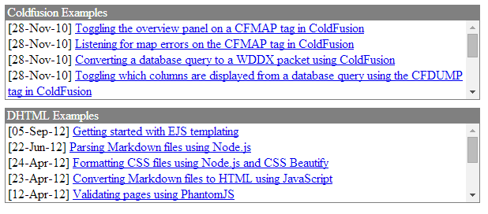

CFPOD
===
The `<cfpod>` creates an area of the browser window with an optional title bar and a body that contains display elements.

We can use a small amount of css to create the same thing.

Our demo will create the following :-

**Listing 1 : index.cfm**

    <cfsetting showdebugoutput="false">
    <!--- CREATE THE CFC OBJECT --->
    <cfset objContent = createObject("component", "cfc.content") />
    <!--- OBTAIN THE FEEDS --->
    <cfset qryFeeds = objContent.srcFeeds() />
    <!doctype html>
    <html lang="en">
    <head>
        <meta charset="utf-8" />
        <meta name="viewport" content="width=1024" />
        <title>CFPOD - ALTERNATIVE USING impress.js</title>
        <link rel="stylesheet" href="css/custom.css">
    </head>
    <cfoutput>
    <body>
        <ul id="feeds" style="display:table;">
            <cfloop query="qryFeeds">
                <cffeed action="read" source="#qryFeeds.feed#" query="rssFeed" />
                
#qryFeeds.site#

                <li id="feed_#qryFeeds.id#" class="feedlist">
                    <ul class="innerlist">
                        <cfloop query="rssFeed">
                            <li>
                                [#dateFormat(rssFeed.publishedDate)#] <a href="#rssFeed.rssLink#">#rssFeed.title#</a>
                            </li>
                        </cfloop>
                    </ul>
                </li>
            </cfloop>
        </ul>
    </body>
    </cfoutput>
    </html>

Here's the CSS.

**Listing 2 : custom.css**

    ul#feeds li {
        list-style-type: none;
    }
    .feedlist {
        overflow-y:scroll;
        height:100px;
        width: 600px;
        margin-bottom: 10px;
        border-left: 1px solid grey;
        border-right: 1px solid grey;
        border-bottom: 1px solid grey;
    }
    .innerlist{
        list-style-type: none;
        padding-left: 3px;  
    }
    .title {
        background-color: grey;
        color: white;
        padding-left: 3px;
    }

And finally the CFC.

**Listing 3 : content.cfc**

    <cfcomponent>
        <!--- LOAD THE DATA --->
        <cfinclude template="data.cfm">
        <!--- GET THE SLIDE DECK DATA --->
        <cffunction name="srcFeeds" access="public" returntype="query">
            <cfset var qryFeeds = ''>
            <cfquery name="qryFeeds" dbtype="query">
                SELECT *
                FROM tblFeeds
            </cfquery>
            <cfreturn qryFeeds />
        </cffunction>
    </cfcomponent>

For further information you can reference :-

* [CFPOD](http://livedocs.adobe.com/coldfusion/8/htmldocs/help.html?content=Tags_p-q_07.html)
