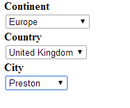

CFSELECT-CHAINED
===
In the past the `<cfselect>` tag has been used, via the **BINDING** parameter to **CHAIN** select elements.

It works but has it's limits.

(If you have more than 1024 items in a CFSELECT then the CFSELECT tag fails.)

Yes, you are saying that 1024 items in a select list is a stupid idea. 
I agree, but it **happens** in the ecommerce world.

I have blogged about this in the past because it was a problem that I needed to solve.

What follows is an approach that lets you specify the table you want to use and depends on :-

1. The table you want to perform the **LOOKUP** on.
2. The **VALUE** you want to use in the **SELECT**.
3. The **TEXT** that is displayed in the **SELECT** element.

So what we want to achieve here is **THREE** select elements that are **BOUND** to each other using the tables and ID's that we select.

This is the output :-

The HTML is quite simple. We load jQuery, main.js and then the HTML as follows:- 

**Listing 1 : index.cfm**

    <!DOCTYPE html>
    <html lang="en">
    <head>
        <meta charset="utf-8">
        <title>jQuery Chained Select</title>
        
        
    </head>
    <body>
        <cfoutput>
            <strong>Continent</strong>
             
            <select id="idContinent">
                <option value="0">Select Continent</option>
            </select>
             
            <strong>Country</strong>
             
            <select id="idCountry">
                <option value="0">Select Country</option>
            </select>
             
            <strong>City</strong>
             
            <select id="idCity">
                <option value="0">Select City</option>
            </select>
        </cfoutput>
    </body>
    <footer>
    </footer>
    </html>

AFTER the page has LOADED then the main.js kicks in and populates the required SELECT elements.

**Listing 2 : main.js**

    $(document).ready(function(){
        function resetSelect(elemIdName,elemIdDefault,elemValueDefault){
            var sel = '<select id="' + elemIdName + '">';
            sel += '<option value="' + elemIdDefault + '">' + elemValueDefault + '</option>';
            sel += '</select>';
            $('#' + elemIdName).replaceWith(sel);
        }
        function chainedSelect(elemIdName,elemIdDefault,elemValueDefault,cfc,method,table,idCol,valueCol,distinct,selected,colToSearch,format){
            var strURL = cfc + '.cfc?';                 //CFC TO BE CALLED
            strURL += 'method=' + method;               //METHOD TO USE
            strURL += '&strTableName=' + table;         //TABLE NAME TO SELECT RECORDS FROM
            strURL += '&strID=' + idCol;                //COLUMN USED TO POPULATE THE SELECT VALUE
            strURL += '&strName=' + valueCol;           //COLUMN USED TO POPULATE THE SELECT TEXT
            strURL += '&intDistinct=' + distinct;       //USE DISTINCT IN QUERY 0/1 (TRUE/FALSE)
            strURL += '&selectedID=' + selected;        //VALUE OF THE SELECT
            strURL += '&selectedCol=' + colToSearch;    //COLUMN TO SEARCH USING THE selectedID
            strURL += '&ReturnFormat=' + format;        //RETURN FORMAT
            $.ajax({
                url: strURL,
                dataType: 'json',
                success: function(response){
                    var i;
                    var sel = '<select id="' + elemIdName + '">';
                    sel += '<option value="' + elemIdDefault + '">' + elemValueDefault + '</option>';
                    //BUILD SELECT
                    for (i = 0; i < response.DATA.length; i++){
                        sel += '<option value="';
                        sel += response.DATA[i][0];
                        sel +=  '">';
                        sel += response.DATA[i][1];
                        sel += '</option>';
                    }
                    sel += '</select>';
                    $('#' + elemIdName).replaceWith(sel);
                },
                error: function(ErrorMsg){
                    console.log('Error');
                }
            })
        }
        //CONTINENT SELECT - CHANGE HANDLER
        $('body').on('change', '#idContinent', function(e) {
            var strSelected = $("#idContinent").val();
            chainedSelect(
                'idCountry',        //SELECT BOX ID  
                0,                  //SELECT BOX DEFAULT VALUE
                'Select Country',   //SELECT BOX DEFAULT TEXT
                'content',          //CFC TO BE CALLED
                'getContent',       //METHOD TO USE
                'tblCountry',       //TABLE NAME TO SELECT RECORDS FROM
                'code',             //COLUMN USED TO POPULATE THE SELECT VALUE
                'name',             //COLUMN USED TO POPULATE THE SELECT TEXT
                0,                  //USE DISTINCT IN QUERY 0/1 (TRUE/FALSE)
                strSelected,        //VALUE OF THE SELECT
                'continent_id',     //COLUMN TO SEARCH USING THE strSelected
                'json'              //RETURN FORMAT
            );
            resetSelect('idCity',0,'Select City');
        });
        //COUNTRY SELECT - CHANGE HANDLER
        $('body').on('change', '#idCountry', function(e){
            var strSelected = $("#idCountry").val();
            chainedSelect(
                'idCity',       //SELECT BOX ID  
                0,              //SELECT BOX DEFAULT VALUE
                'Select City',  //SELECT BOX DEFAULT TEXT
                'content',      //CFC TO BE CALLED
                'getContent',   //METHOD TO USE
                'tblCity',      //TABLE NAME TO SELECT RECORDS FROM
                'code',         //COLUMN USED TO POPULATE THE SELECT VALUE
                'name',         //COLUMN USED TO POPULATE THE SELECT TEXT
                0,              //USE DISTINCT IN QUERY 0/1 (TRUE/FALSE)
                strSelected,    //VALUE OF THE SELECT
                'code',         //COLUMN TO SEARCH USING THE strSelected
                'json'          //RETURN FORMAT
            );
        });
        //INITIALISE THE SELECTS
        chainedSelect(
            'idContinent',      //SELECT BOX ID  
            0,                  //SELECT BOX DEFAULT VALUE
            'Select Continent', //SELECT BOX DEFAULT TEXT
            'content',          //CFC TO BE CALLED
            'getContent',       //METHOD TO USE
            'tblContinent',     //TABLE NAME TO SELECT RECORDS FROM
            'id',               //COLUMN USED TO POPULATE THE SELECT VALUE
            'name',             //COLUMN USED TO POPULATE THE SELECT TEXT
            1,                  //USE DISTINCT IN QUERY 0/1 (FALSE/TRUE)
            0,                  //VALUE OF THE SELECT
            'id',               //COLUMN TO SEARCH USING THE strSelected
            'json'              //RETURN FORMAT
        );
    });

Whenever a **Select** box element is selected, then the AJAX call to the **getContent** method contained in content.cfc is called :-

**Listing 3 : content.cfc**

    <cfcomponent>
        <!--- CONTINENT DATA --->
        <cfset tblContinent = queryNew("name,id", "varchar,varchar", [
            {name:"Africa",id:"AF"},
            {name:"Europe",id:"EU"},
            {name:"North America",id:"NA"}
        ])>
        <!--- COUNTRY DATA --->
        <cfset tblCountry = queryNew("name,code,continent_id", "varchar,varchar,varchar", [
            {name:"Cameroon",code:"CMR",continent_id:"AF"},
            {name:"Eritrea",code:"ERI",continent_id:"AF"},
            {name:"Ghana",code:"GHA",continent_id:"AF"},
            {name:"United Kingdom",code:"GBR",continent_id:"EU"},
            {name:"Iceland",code:"ISL",continent_id:"EU"},
            {name:"Latvia",code:"LVA",continent_id:"EU"},
            {name:"Bahamas",code:"BMU",continent_id:"NA"},
            {name:"Panama",code:"PAN",continent_id:"NA"},
            {name:"United States",code:"USA",continent_id:"NA"}
        ])>
        <!--- CITY DATA --->
        <cfset tblCity = queryNew("name,code", "varchar,varchar", [
            {name:"Hamilton",code:"BMU"},
            {name:"Saint George",code:"BMU"},
            {name:"Bamenda",code:"CMR"},
            {name:"Garoua",code:"CMR"},
            {name:"Maroua",code:"CMR"},
            {name:"Asmara",code:"ERI"},
            {name:"Blackburn",code:"GBR"},
            {name:"London",code:"GBR"},
            {name:"Preston",code:"GBR"},
            {name:"Accra",code:"GHA"},
            {name:"Kumasi",code:"GHA"},
            {name:"Tamale",code:"GHA"},
            {name:"Reykjavik",code:"ISL"},
            {name:"Daugavpils",code:"LVA"},
            {name:"Riga",code:"LVA"},
            {name:"Ciudad de Panama",code:"PAN"},
            {name:"San Miguelito",code:"PAN"},
            {name:"Chattanooga",code:"USA"},
            {name:"Lafayette",code:"USA"},
            {name:"New York",code:"USA"}
        ])>
        <cffunction name="getContent" access="remote" returntype="query" output="true">
            <cfargument name="strTableName" type="string" required="true">
            <cfargument name="strID" type="string" required="true">
            <cfargument name="strName" type="string" required="true">
            <cfargument name="intDistinct" type="numeric" required="false" default="0">
            <cfargument name="selectedCol" type="string" required="false" default="0">
            <cfargument name="selectedID" type="string" required="false" default="0">
            <cfquery name="qryContent" dbtype="query">
                select
                <cfif arguments.intDistinct eq 1>distinct</cfif>
                #arguments.strID# as theID,
                #arguments.strName# as theValue
                from #arguments.strTableName#
                <cfif arguments.selectedID neq 0>
                  where #arguments.selectedCol# = '#arguments.selectedID#'
                </cfif>
                order by #arguments.strName#
            </cfquery>
            <cfreturn qryContent />
        </cffunction>
    </cfcomponent>

You will of course need to get rid of the reference to **dbtype="query"**
and provide the **DATASOURCE** instead, then the **METHOD** will point to a **sql table** instead of the static data that was used in oder to make this demo work.

For further information you can reference :-

* [CFSELECT using bind example 1](http://www.raymondcamden.com/index.cfm/2008/9/14/Triple-Related-Selects-and-interesting-CFDIV-trick)
* [CFSELECT using bind example 2](http://www.podhalany.co.uk/triple-chainedrelated-selects-in-coldfusion/)

