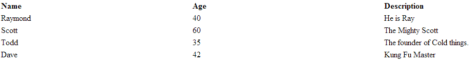

CFTABLE
===

The `<cftable>` tag creates a table.  Who knew? Go figure.

In the example below taken from [Adobe](http://livedocs.adobe.com/coldfusion/8/htmldocs/help.html?content=Tags_t_01.html) you will notice I have added some static data, I will use this throughout the examples :-

**Listing 1 : cftable.cfm**

    <cfset data = queryNew("name,age,desc", "varchar,integer,varchar", [
        {name:"Raymond",age:40,desc:"He is Ray"},
        {name:"Scott",age:60,desc:"The Mighty Scott"},
        {name:"Todd",age:35,desc:"The founder of Cold things."},
        {name:"Dave",age:42,desc:"Kung Fu Master"}
    ])>
    <cfquery name="qryData" dbtype="query">
        SELECT *
        FROM data
    </cfquery>
    <!DOCTYPE html>
    <html lang="en">
    <body>
        <cftable query="qryData" startRow="1" colSpacing="3" HTMLTable colHeaders>
            <cfcol header="<b>Name</b>" align="Left" width="15" text="#name#">
            <cfcol header="<b>Age</b>" align="Left" width="15" text="#age#">
            <cfcol header="<b>Description</b>" align="Left" width="15" text="#desc#">
        </cftable>
    </body>
    </html>

This is the output :-

According to the documentation you **cannot** nest cftable tags.

Not good, looks awful. You could mess about with the tag and make it look OK, but you already know that you have to learn CSS and JavaScript/jQuery.

We can build a TABLE using HTML and our static data and query like this :-

**Listing 2 : index.cfm**

    <cfset data = queryNew("name,age,desc", "varchar,integer,varchar", [
        {name:"Raymond",age:40,desc:"He is Ray"},
        {name:"Scott",age:60,desc:"The Mighty Scott"},
        {name:"Todd",age:35,desc:"The founder of Cold things."},
        {name:"Dave",age:42,desc:"Kung Fu Master"}
    ])>
    <cfquery name="qryData" dbtype="query">
        SELECT *
        FROM data
    </cfquery>
    <!DOCTYPE html>
    <html lang="en">
    <cfoutput>
        <body>
            <table>
                <thead>
                    <tr>
                        <th>Name</th>
                        <th>Age</th>
                        <th>Description</th>
                    </tr>
                </thead>
                <tbody>
                    <cfloop query="qryData">
                        <tr>
                            <td>#name#</td>
                            <td>#age#</td>
                            <td>#desc#</td>
                        </tr>
                    </cfloop>
                </tbody>
            </table>
        </body>
    </cfoutput>
    </html>

Of course you can use CSS to make the table look fancy but I just kept it simple here.

If you are going to make heavy use of tables ( for reports etc ) then a good jQuery plugin to allow you to sort the table via the column headings is :-

* [DATATABLES](https://datatables.net/index)

For further information you can reference :-

* [CFTABLE](http://livedocs.adobe.com/coldfusion/8/htmldocs/help.html?content=Tags_t_01.html)
* [DATATABLES](https://datatables.net/index)

