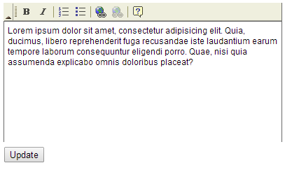
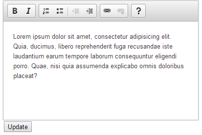

CFTEXTAREA
===
The `<cftextarea>` tag gives you a rich text editing tool.

It is based on [fckeditor](http://en.wikipedia.org/wiki/CKEditor#History_of_CKEditor_project) which was a forerunner to [ckeditor](http://ckeditor.com/).

[fckeditor](http://en.wikipedia.org/wiki/CKEditor#History_of_CKEditor_project) is no longer supported.

Here I am going to use [ckeditor](http://ckeditor.com/) to achive the same thing as `<cftextarea>`.

Firstly `<cftextarea>`.

**Listing 1 : cftextarea.cfm**

    <cfparam name="textarea_1" default="">
    <!DOCTYPE html>
    <html lang="en">
    <head>
        <meta charset="utf-8">
        <title>CFTEXTAREA</title>
        <link rel="stylesheet" href="css/custom.css">
    </head>
    <body>
        <cfoutput>
            <cfform name="frmExample">
                

                    <cftextarea name="textarea_1" richtext="true" toolbar="Basic">
                        Lorem ipsum dolor sit amet, consectetur adipisicing elit. Quia, ducimus, libero reprehenderit fuga recusandae iste laudantium earum tempore laborum consequuntur eligendi porro. Quae, nisi quia assumenda explicabo omnis doloribus placeat?
                    </cftextarea>
                

                <cfinput type="submit" value="Update" name="frmExample_submit"/>
            </cfform>
            #textarea_1#
        </cfoutput> 
    </body>
    </html>

And now the alternative to `<cftextarea>`.

**Listing 2 : index.cfm**

    <cfparam name="textarea_1" default="">
    <!DOCTYPE html>
    <html lang="en">
    <head>
        <meta charset="utf-8">
        <title>CFTEXTAREA Alternative</title>
        <link rel="stylesheet" href="css/custom.css">
    </head>
    <body>
        <cfoutput>
            

                <form name="frmExample" >
                    <textarea id="textarea_1" name="textarea_1">
                        Lorem ipsum dolor sit amet, consectetur adipisicing elit. Quia, ducimus, libero reprehenderit fuga recusandae iste laudantium earum tempore laborum consequuntur eligendi porro. Quae, nisi quia assumenda explicabo omnis doloribus placeat?
                    </textarea>
                    <input type="submit" value="Update" name="frmExample_submit"/>
                </form> 
            

            #textarea_1#
        </cfoutput>
    </body>
    <footer>
        
        
    </footer>
    </html>

For further information you can reference :-

* [ckeditor](http://ckeditor.com/)
* [fckeditor](http://en.wikipedia.org/wiki/CKEditor#History_of_CKEditor_project)
* [cftextarea](http://livedocs.adobe.com/coldfusion/8/htmldocs/help.html?content=Tags_t_02.html)

