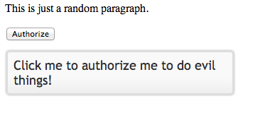

cftooltip
===

The &lt;cftooltip&gt; tag provides the ability to create a tooltip for an HTML item. As an example:

    <cftooltip tooltip="This text explains the stuff below.">
	
This is some text.

	</cftooltip>
	
When the user hovers over the HTML surrounded by the tag, a small box will pop up with the text specified by the tooltip attribute. Other attributes include basic styling options as well as timing controls. Finally, the tag also lets you specify a remote URL to populate the text of the tooltip. 

For this chapter we will make use of the [jQuery UI Tooltip](http://jqueryui.com/tooltip/) library. The jQuery UI library contains multiple different widgets (and is used in multiple examples in this project) but you can, and should, use the minimal required code for the widgets you need. The [download builder](http://jqueryui.com/download/) lets you specify only what you need and we've done that already for the demo files.

Here is a simple example, totally written in simple html. 

**Listing 1 : test1.html**

	<!doctype html>
	<html lang="en">
	<head>
		<meta charset="utf-8">
		<title>Test1</title>
		<link rel="stylesheet" href="lib/css/ui-lightness/jquery-ui-1.10.4.custom.min.css">
		
		
	
		
	
	</head>
	<body>
	 
		

			This is just a random paragraph.
		

	
		

			<button id="doSomething" title="Click me to authorize me to do evil things!">Authorize</button>
		

		
	</body>
	</html>

All jQuery UI templates require one CSS file, jQuery (of course), and the jQueryUI library (and remember, we have an optimized version here just supporting one widget). In our HTML page we have a button we want to add a tooltip to. To activate the tooltip, we use a document.ready block, find the element we want to enhance, and just run tooltip(). With no options jQuery UI will use the title from the DOM item as the text of the tooltip.

Now let's take that same example and make it dynamic. In listing 2, we've got a basic query (remember, all queries in this project are fake so you can run as is, in a real project this would be an actual call to a database) that returns a record of people. We're going to use the jQuery UI to create tooltips for each person's name. 

**Listing 2 : test2.cfm**

	<cfset data = queryNew("name,age,desc", "varchar,integer,varchar", [
		{name:"Raymond",age:40,desc:"He is Ray"},
		{name:"Scott",age:60,desc:"The Mighty Scott"},
		{name:"Todd",age:35,desc:"The founder of Cold things."},
		{name:"Dave",age:42,desc:"Kung Fu Master"}
		])>
		
	<!doctype html>
	<html lang="en">
	<head>
		<meta charset="utf-8">
		<title>Test1</title>
		<link rel="stylesheet" href="lib/css/ui-lightness/jquery-ui-1.10.4.custom.min.css">
		
		
	
		
	
	</head>
	<body>
	 
		

			This is just a random paragraph.
		

	
		<cfoutput query="data">
			<h1 title="This is #name#, who is #age# years old and: #desc#">#name#</h1>
		</cfoutput>	
	</body>
	</html>

As you can see, this follows the same format as the static example. We've got a DOM item, in this case an h1 tag, with a title attribute that is normally hidden from view. jQuery UI takes over the normal hover effect and replaces it with styled tooltip window based on the dynamic data we used in the title attribute. 

Now lets take it up a notch. The jQuery UI tooltip allows for customization of the look and feel of the tooltip as well as it how it interacts with the mouse. This is all covered in the documentation. We're going to look at something else - AJAX integration. In the previous examples, the data for the tooltip was embedded in the DOM itself. You don't have to do that, however, you can just as easily bind the tooltip to an AJAX result. Let's look  at an example in listing 3.

**Listing 3 : test3.cfm**

	<cfset data = queryNew("id,name,age,desc", "integer,varchar,integer,varchar", [
		{id:1, name:"Raymond",age:40,desc:"He is Ray"},
		{id:2, name:"Scott",age:60,desc:"The Mighty Scott"},
		{id:3, name:"Todd",age:35,desc:"The founder of Cold things."},
		{id:4, name:"Dave",age:42,desc:"Kung Fu Master"}
		])>
		
	<!doctype html>
	<html lang="en">
	<head>
		<meta charset="utf-8">
		<title>Test1</title>
		<link rel="stylesheet" href="lib/css/ui-lightness/jquery-ui-1.10.4.custom.min.css">
		
		
	
		
	
	</head>
	<body>
	 
		

			This is just a random paragraph.
		

	
		<cfoutput query="data">
			
#name#

		</cfoutput>	
	</body>
	</html>

This version is a bit more complex. Notice that the JavaScript code has been modified to pass some arguments to the tooltip constructor. The items attribute specifies a CSS selector to use for figuring out what items will need tooltips. In this case we've changed the h1 tags to simple P tags with a "person" class attached to them. The content attribute determines what will make up the content of the tooltip. You could just return a simple value here, but most likely you will be doing something asynchronous. To make this easier, jQuery UI will automatically pass a callback value you can use to return a value whenever your asynchronous operation completes. In this case, a simple AJAX call to a CFC. Note that we are using HTML5 data attributes to store an ID value. We can fetch it from the current paragraph being hovered over and then pass that to the CFC. Listing 4 is the CFC. For the purposes of this demo it just returns a simple dynamic string based on the ID value.

**Listing 4 : service.cfc**

	component {
	
		//Little trick to set all response types to JSON
		url.returnformat="json";
	
		remote function getData(required numeric id) {
			return "Pretend I did a db lookup for person #arguments.id# and I got some stuff.";
		}
	
	}

Alternatives
---

* [qTip](http://craigsworks.com/projects/qtip/) - a jQuery plugin

