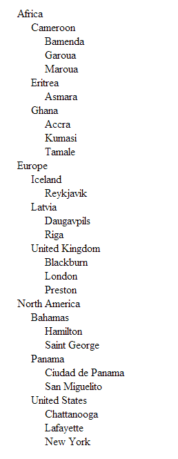

CFTREE
===
The `<cftree>` tag lets you display hierarchical information.

So here we are going to use **hierarchical data** which is then processed with a **recursive alogorithm** to retun a tree built from simple HTML `<ul>` and `<li>` tags.

This is the output :-

In the index.cfm file we load the **tree data** by calling the *getSourceData* and then the *getTree* method contained in the **content.cfc** file. Then we load the  **CSS** and then the **HTML** as follows:- 

**Listing 1 : index.cfm**

    <!--- CREATE THE CFC OBJECT --->
    <cfset objContent = createObject("component", "content") />
    <!--- GET THE INITIAL DATA SOURCE --->
    <cfset getSourceData = objContent.getSourceData()>
    <!--- GET THE TREE --->
    <cfset getTree = objContent.generateTree(ParentID=0,level=0,prev_thing=0,qryTree=getSourceData)>
    <!DOCTYPE html>
    <html lang="en">
    <head>
        <meta charset="utf-8">
        <title>CFTREE Alternative</title>
        <link rel="stylesheet" href="css/custom.css">
        
        
    </head>
    <body>
        

            <cfoutput>#getTree#</cfoutput>
        

    </body>
    <footer>
    </footer>
    </html>

Just a sprinkling of CSS :-

**Listing 2 : custom.css**

    ul li {
        margin-left: -20px;
        list-style-type: none;
        cursor: pointer; cursor: hand;
    }
    .tree-hide {
        display: none;
    }
    .tree-show {
        display: block;
    }

The **generateTree** method is the recursive function and does all the heavey lifting.
Follow the comments in **generateTree** method to understand how it all fits together.

**Listing 3 : content.cfc**

    <cfcomponent>
        <cfset tblPlaces = queryNew("id,name,parent_id,display_order", "integer,varchar,integer,integer", [
            {id:1,name:"Africa",              parent_id:0,    display_order:1},
            {id:2,  name:"Europe",            parent_id:0,    display_order:2},
            {id:3,  name:"North America",     parent_id:0,    display_order:3},
            {id:4,  name:"Cameroon",          parent_id:1,    display_order:1},
            {id:5,  name:"Eritrea",           parent_id:1,    display_order:2},
            {id:6,  name:"Ghana",             parent_id:1,    display_order:3},
            {id:7,  name:"United Kingdom",    parent_id:2,    display_order:3},
            {id:8,  name:"Iceland",           parent_id:2,    display_order:1},
            {id:9,  name:"Latvia",            parent_id:2,    display_order:2},
            {id:10, name:"Bahamas",           parent_id:3,    display_order:1},
            {id:11, name:"Panama",            parent_id:3,    display_order:2},
            {id:12, name:"United States",     parent_id:3,    display_order:3},
            {id:13, name:"Hamilton",          parent_id:10,   display_order:1},
            {id:14, name:"Saint George",      parent_id:10,   display_order:2},
            {id:15, name:"Bamenda",           parent_id:4,    display_order:1},
            {id:16, name:"Garoua",            parent_id:4,    display_order:2},
            {id:17, name:"Maroua",            parent_id:4,    display_order:3},
            {id:18, name:"Asmara",            parent_id:5,    display_order:1},
            {id:19, name:"Blackburn",         parent_id:7,    display_order:1},
            {id:20, name:"London",            parent_id:7,    display_order:2},
            {id:21, name:"Preston",           parent_id:7,    display_order:3},
            {id:22, name:"Accra",             parent_id:6,    display_order:1},
            {id:23, name:"Kumasi",            parent_id:6,    display_order:2},
            {id:24, name:"Tamale",            parent_id:6,    display_order:3},
            {id:25, name:"Reykjavik",         parent_id:8,    display_order:1},
            {id:26, name:"Daugavpils",        parent_id:9,    display_order:1},
            {id:27, name:"Riga",              parent_id:9,    display_order:2},
            {id:28, name:"Ciudad de Panama",  parent_id:11,   display_order:1},
            {id:29, name:"San Miguelito",     parent_id:11,   display_order:2},
            {id:30, name:"Chattanooga",       parent_id:12,   display_order:1},
            {id:31, name:"Lafayette",         parent_id:12,   display_order:2},
            {id:32, name:"New York",          parent_id:12,   display_order:3}
        ])>
        <!--- GET THE SOURCE DATA --->
        <cffunction name="getSourceData" access="public" returntype="query">
            <cfquery name="qrySourceData" dbtype="query">
                select * 
                from tblPlaces
            </cfquery>
            <cfreturn qrySourceData />
        </cffunction>
        <!--- INITIALISE PUBLIC VARIABLES --->
        <cfset VARIABLES.outputString = "">
        <cfset VARIABLES.tree = "">
        <cfset VARIABLES.prev_parent = "">
        <cffunction name="generateTree" access="public" returntype="string">
            <cfargument name="parent_id" type="numeric" required="yes" default=0 />
            <cfargument name="level" type="numeric" required="yes" default=0 />
            <cfargument name="prev_parent" type="numeric" required="yes" default=0 />
            <cfargument name="qryTree" type="query" required="yes" />
            <!--- THIS VARIABLE CHECKS IF WE HAVE CHILDREN IN THS ITERATION --->
            <cfset var checkForChildren = "">
            <!--- THIS VARIABLES HOLDS THE LOCAL SUB-QUERIES PARTICULAR TO THIS ITERATION --->
            <cfset var objTree = "">
           <!--- IF THIS IS OUR INITIAL CALL (FIRST TIME THROUGH) THEN WE NEED TO GET THE SOURCE DATA --->
            <cfif arguments.level eq 0>
                <cfset VARIABLES.tree = qryTree>
                <cfset VARIABLES.outputString = "">
            </cfif>
            <!--- GET ALL THE RECORDS THAT ARE CHILDREN OF THE CURRENT PARENT --->
            <cfquery name="objTree" dbtype="query">
                select * 
                from VARIABLES.tree 
                where parent_id = <cfqueryparam value="#arguments.parent_id#" cfsqltype="cf_sql_integer">
                order by display_order
            </cfquery>
            <!--- SET THE DEFAULT  strULClass.  --->
            <!--- WE USE THIS TO INITIALLY SET THE TOP LEVEL ITEM(S) AS VISIBLE AND EVERYTHING ELSE AS HIDDEN  --->
            <cfif arguments.level EQ 0>
                <cfset strULClass='tree'>
            <cfelse>
                <cfset strULClass='tree tree-hide'>
            </cfif>
            <!--- START THE NEW CHILDREN LIST <UL> --->
            <cfset VARIABLES.outputString = VARIABLES.outputString & '<ul class="#strULClass#" id="ul-#arguments.parent_id#">'>
            <!--- LOOP OVER THE CHILDREN OF THIS PARENT --->
            <cfloop query="objTree">
                    <!--- GET THE DATA BASED ON THE CURRENT ITERATION --->
                    <cfquery name="checkForChildren" dbtype="query">
                        select * from VARIABLES.tree where parent_id = <cfqueryparam value="#objTree.id#" cfsqltype="cf_sql_integer">
                    </cfquery>
                    <!--- DOES THIS ELEMENT HAVE CHILDREN OR IS IT THE FINAL NODE --->
                    <cfif checkForChildren.recordcount gt 0>
                        <!--- WE HAVE SOME CHILDREN NODES SO WE WILL HAVE TO ITERATE AGAIN ( I.E CALL THIS FUNCTION AGAIN ) --->
                        <cfset VARIABLES.prev_parent = objTree.id>
                        <cfset VARIABLES.outputString = VARIABLES.outputString & '<li '>
                        <cfset VARIABLES.outputString = VARIABLES.outputString & 'class="tree parent-#arguments.prev_parent#" '>
                        <cfset VARIABLES.outputString = VARIABLES.outputString & 'id="#objTree.id#" '>
                        <cfset VARIABLES.outputString = VARIABLES.outputString & 'data-level="#arguments.level#">'>
                        <cfset VARIABLES.outputString = VARIABLES.outputString & objTree.name>
                        <cfset generateTree(parent_id = objTree.id, level = arguments.level + 1, prev_parent = VARIABLES.prev_parent, qryTree = qryTree)>
                    <cfelse>
                        <!--- NO CHILDREN FOR THIS CHILD. --->
                        <!--- SO WE DO NOT HAVE TO ITERATE AGAIN ( I.E CALL THIS FUNCTION AGAIN ) --->
                        <!--- WE JUST ADD IT TO THE OUTPUT STRING --->
                        <cfset VARIABLES.outputString = VARIABLES.outputString & '<li '>
                        <cfset VARIABLES.outputString = VARIABLES.outputString & 'class="tree parent-#VARIABLES.prev_parent#" '>
                        <cfset VARIABLES.outputString = VARIABLES.outputString & 'id="#objTree.id#" '>
                        <cfset VARIABLES.outputString = VARIABLES.outputString & 'data-level="#arguments.level#">'>
                        <cfset VARIABLES.outputString = VARIABLES.outputString & objTree.name>
                    </cfif>
                    <!--- CLOSE LIST ITEM --->
                    <cfset VARIABLES.outputString = VARIABLES.outputString & '</li>'>
            </cfloop>
            <!--- CLOSE UL --->
            <cfset VARIABLES.outputString = VARIABLES.outputString & '</ul>'>
            <!--- RETURN OUTPUT STRING --->
            <cfif arguments.level eq 0>
                <cfreturn VARIABLES.outputString>
            </cfif>
        </cffunction>
    </cfcomponent>

And finally when an `<li>` is clicked, if there is a `<ul>` underneath it then we show/hide that `<ul>`.

**Listing 4 : main.js**

    $(document).ready(function(){
        $( ".tree" ).on( "click", "li", function(e) {    
            var clicked = $("#ul-" + $(this).prop("id"));
            if(clicked.hasClass("tree-hide")) {
                clicked.removeClass("tree-hide");
                clicked.addClass("tree-show");
            }
            else {
                clicked.addClass("tree-hide");
                clicked.removeClass("tree-show");
            }
            e.stopPropagation();
        });
    });

For further information you can reference :-

* [Recursion](http://www.bennadel.com/blog/1069-Ask-Ben-Simple-Recursion-Example.htm)

