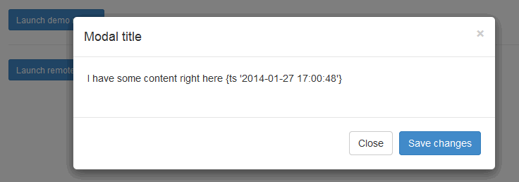
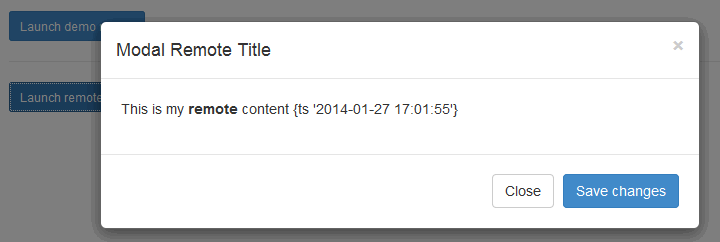

cfwindow
===

The &lt;cfwindow&gt; tag provides the ability to create a modal dialog. As an example:

    <input type="button" name="mybutton" value="Show Dialog" onclick="javascript:ColdFusion.Window.show('myWindow')">
    <cfwindow name="myWindow" title="This is my modal dialog" center="true">
        I have some content right here <cfoutput>#Now()#</cfoutput>
    </cfwindow>
    
When the user clicks on the button, it displays a dialog on the screen. The content of the dialog can be a defined between the opening and closing &lt;cfwindow&gt; tags, or loaded from a remote file via the "source" attribute. Other attributes include basic styling options.

For this example, we will make use of the [Bootstrap Modal](http://getbootstrap.com/javascript/#modals) plugin. Bootstrap is a lightweight framework of CSS and minimal JavaScript, allowing you to create dynamic interfaces with very little code, and focusing more on convention over configuration. For this example, we will use a CDM (Content Delivery Network) to include the necessary jQuery and Bootstrap files. In this demo, no additional scripting is required.

**Listing 1 : index.cfm**

    <!doctype html>
    <html lang="en">
        <head>
            <meta charset="utf-8">
            <title>Test1</title>
            <link rel="stylesheet" href="//netdna.bootstrapcdn.com/bootstrap/3.0.3/css/bootstrap.min.css">
        </head>
        <body>
            <button class="btn btn-primary btn-lg" data-toggle="modal" data-target="#myModal">
                Launch demo modal
            </button>
            

                

                    

                        

                            <button type="button" class="close" data-dismiss="modal" aria-hidden="true">&times;</button>
                            <h4 class="modal-title" id="myModalLabel">Modal title</h4>
                        

                        

                            
I have some content right here <cfoutput>#Now()#</cfoutput>

                        

                        

                            <button type="button" class="btn btn-default" data-dismiss="modal">Close</button>
                            <button type="button" class="btn btn-primary">Save changes</button>
                        

                    
<!-- /.modal-content -->
                
<!-- /.modal-dialog -->
            
<!-- /.modal -->
            <!-- jQuery (necessary for Bootstrap's JavaScript plugins) -->
            
            
        </body>
    </html>

Use of Bootstrap requires the use of the Bootstrap CSS file, jQuery, and the Bootstrap JS file. Bootstrap uses data attributes (it's options preceded by _data-_) to define the options of the plugin, or an optional configuration within script. The aria attributes (those preceded by _aria-_) are optional, and are used by assistive devices.

Like &lt;cfwindow&gt;, you can pull remote content in to your dialog. In your base file, you only include the trigger and the base modal container.

**Listing 2 : index.cfm - remote dialog code**

    <button class="btn btn-primary btn-sm" data-toggle="modal" data-target="#myModal2" data-remote="mycontent2.cfm">
        Launch remote demo modal
    </button>
    

    
The, in your remote file you include the header, content, and footer for your modal.

**Listing 3 : mycontent2.cfm**

    

        

            

                <button type="button" class="close" data-dismiss="modal" aria-hidden="true">&times;</button>
                <h4 class="modal-title">Modal Remote Title</h4>
            

            

                <cfoutput>This is my <b>remote</b> content #Now()#</cfoutput>
            

            

                <button type="button" class="btn btn-default" data-dismiss="modal">Close</button>
                <button type="button" class="btn btn-primary">Save changes</button>
            

        
<!-- /.modal-content -->
    
<!-- /.modal-dialog -->
    

    
For finer degrees of control, one can bind to a modal's "shown.bs.modal" or "hidden.bs.modal", or others, to further control content and actions. All events are namespaced, to assist in preventing broadcast collisions, and further define control.

    
    
For supporting advanced options, such as modal stacking, convention width/height, and more, you may want to include the [Bootstrap Modal Manager](https://github.com/jschr/bootstrap-modal) plugin. To make your JS alert, confirm, and prompt dialogs consistent with your application, you can also include the [BootboxJS](http://bootboxjs.com) plugins. Bootstrap does not support draggable or manually resizable modals at this time.

Alternatives
---

* [jQueryUI Dialog](http://jqueryui.com/dialog/)